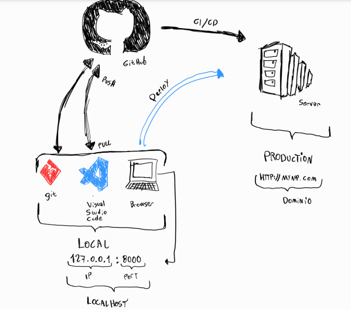
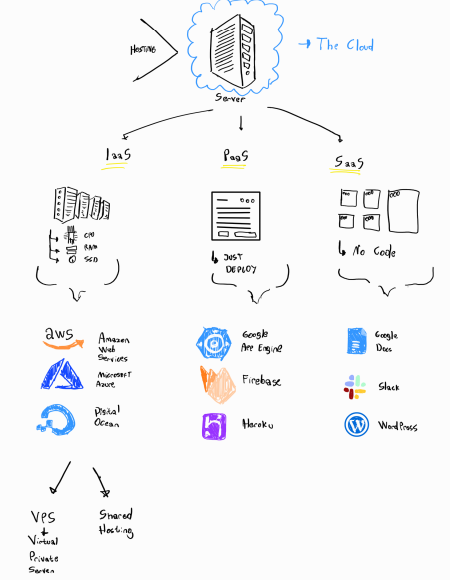
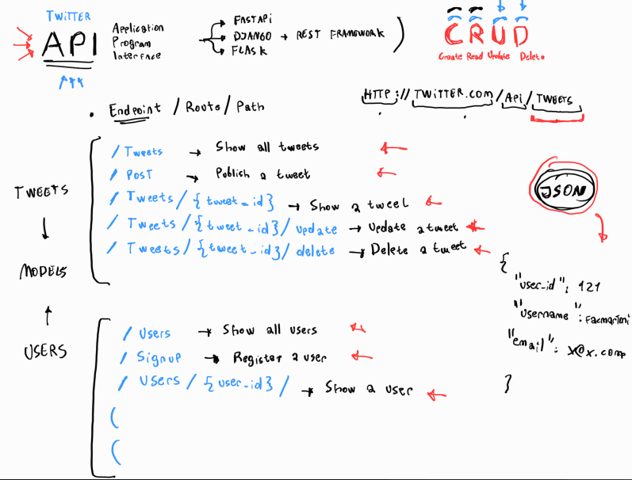

# 5_Curso_de_Introduccion_al_Desarrollo_Backend

<p align="center"></p>

     

# Ying y Yang de una Aplicación : Fronted y Backend


# Framework vs. Libreía 

## Framework

Será la base sobre la cual podrás construir y desarrollar tu proyecto, incluye todas las herramientas necesarias para completarlo(incluye librerías, estándares y reglas). 

## Librería

Sólo aborda una utilidad específica, pudiendo agregar más de una en tu proyecto. Eso si, asegurate que no interfieran con el código de otra librería. 

*Recuerda: Ninguno es mejor que el otro, todo va a depender de la necesidad de tu proyecto*

# Cómo se Conecta el Frontend con el Backend: API y JSON

La unión entre el Frontend y el Backend se hace a través de una API: Application Programming Interface.

Una API es una sección del backend que permite que el frontend pueda comunicarse con él a través de mensajes bidireccionales (de ida y vuelta).

Tenemos dos grandes estándares para crear las APIs:

* SOAP (Simple Objetct Access Protocol): Mueve la información a través de un lenguaje XML (Extensible Markup Language). Es similar al HTML, es un lenguaje demarcado. SOAP es un protocolo que ha quedado en el olvido.
```xml
<?xml version="1.0"?>
<note>
    <to>Miguel</to>
    <from>Facundo</from>
    <heading>Recordatorio</heading>
    <body>¡No olvides publicar el curso!</body>
</note>
```
* Rest (Representational State Transfer): Utiliza otro lenguaje JSON (Javascript Objet Notation). Un JSON no es más que un diccionario de Python. Los diccionarios de Python son lo mismo que los objetos de JS.

```python
{
    "firstname": "Jhon",
    "lastname": "Smith",
    "isAlive": true,
    "age": 27,
    "address": {
        "streetAddress": "21 2nd Street",
        "city": "New York",
        "state": "NY",
        "postalCode": "10021-3100"
    },
    "phoneNumbers": [
        {
            "type": "home",
            "number": "212 555-1234"
        },
        {
            "type": "office",
            "number": "646 555-4567
        }
    ],
    "children": [],
    "spouse: null
}
```
# El Lenguaje que Habla Internet: HTTP

```html
#Request

GET / HTTP/1.1
Host: developer.mozilla.org
Accept-Languaje: fr

# Response

HTTP/1.1 200 OK
Date: Sat, 09 Oct 2010 14:28:02 GMT
Server: Apache
Last-Modified: Tue,01 Dec 2009 20:18:22 GMT
ETag: "51142bc1-7449-47b075b2891b"
Accept-Ranges: bytes
Content-Length:29769
Content-Type: text/html

<!DoCTYPE html...(here comes the 29769 bytes of the request web page)>
```


# ¿Cómo es el Flujo de Desarrollo de una Aplicación Web?




En el mundo de DevOps existen tres términos bastante populares: **Continuous Integration, Continuous Delivery y Continuous Deployment** ; también podemos verlo como una serie de pasos o buenas prácticas a seguir para conseguir una automatización completa de nuestro proceso de deploy a producción, ayudándonos a reducir nuestros errores y nuestro tiempo de entrega entre actualizaciones, también nos puede ayudar a enfocarnos únicamente a construir nuestro producto.

## Qué es Continuous Integration
Es un proceso en donde cada cambio que realizamos en nuestro código debe ser testeado y verificado por las pruebas que hemos escrito con anterioridad.

Por ejemplo, un equipo de desarrollo puede tener diferentes ramas en Git trabajando sobre diferentes features para la próxima actualización, a la semana esto puede generar más de 500 cambios en nuestro código. Al final de la semana, cuando llegue el momento de unir todos esos cambios a la rama correspondiente, debemos asegurarnos de que todo funcione de la manera esperada, con el menor estrés y la menor cantidad de errores posible.

Con Integración Continua o Continuous Integration no necesitamos esperar para hacer push a nuestra rama con todos esos cambios. En su lugar, todos los cambios realizados se van uniendo a la rama de forma continua y resolviendo los errores que generen esos pequeños cambios. También podemos tener herramientas como TravisCI, Jenkis, etc que nos ayudan en el proceso de conocer cuando un cambio no debería unirse por errores y evita que se haga.

Así cuando llegue el momento de lanzar la actualización ya todos nuestros cambios han sido unidos a la rama de preferencia y todos los problemas han sido resueltos ahorrando mucho más tiempo.


## Qué es Continuous Delivery
Es el mismo proceso anterior, solo que de una manera más automatizada y además nuestros tests de aceptación o acceptance tests deben ser de una gran calidad. Porque Continuous Delivery se asegura de que cada cambio realizado esté listo para ser lanzado a producción.

Ya que cada cambio es lanzado a una etapa intermedia o staging usando herramientas de automatización, debemos tener la confianza de realizar deploy a producción con solo presionar algún botón mágico. Podemos decidir hacerlo de una manera diaria, semanal o como mejor se ajuste a nuestro negocio.

## Qué es Continuous Deployments
Como el nombre implica, nos encargamos de hacer deploy continuamente y de forma automatizada.

Es un paso más allá a Continuous Delivery, acá no vamos a necesitar ningún botón para mandar los cambios a producción y mostrarlos al público. Cada cambio que pase a cada etapa del camino no va a generar ningún tipo de error y se mandará a producción automáticamente.

Puede ser el más difícil de implementar, pero una vez logrado tu equipo de desarrollo puede enfocarse únicamente en construir producto, implementando features y obteniendo feedback más seguido de tus usuarios.

**Conclusión**

Ninguno de estos pasos o buenas prácticas es fácil de lograr o implementar en el equipo, pero es el camino adecuado para alejarse de los dolores de cabeza que pueden ser realizar deploy a producción, también nos ayuda a reducir los errores al momento de realizar nuestra actualización y cualquier tipo de problemas que puedan ser visibles para los usuarios.

# El Hogar de Tu Código: El Servidor

Es una computadora que contiene una aplicación y la distribuye mediante el protocolo HTTP.

## La nube
Son servidores juntos que se encuentan en algún lugar del mundo funcionando y distribuyendo aplicaciones.

Estos se encuentran en un sitio llamado Data Centers

## Data Centers
Son los lugares donde se encuentran los servidores, los cuales almacenan datos (como tu página web, o una aplicación como Facebook)

## Hosting
Es el acto de guardar tu aplicación en un server.

Un espacio en un servidor, donde tu aplicación será guardada.

Existen diferentes tipos de hosting (formas de guardar aplicaciones):

* IaaS: Infrastructure as a Service
* PaaS: Platform as a Service
* SaaS: Software as a Service

## IaaS
Este servicio te da el control de las cosas importantes como La cantidad de 
* CPU
* RAM
* SSD

Para esto existen diferentes opciones:

AWS, Microsoft Azure, Digital Ocean.

Existen dos tipos de IaaS:

VPS (Virtual Private Server)

Servidor privado, recursos solo para tí.

Shared Hosting

Compartes los recursos con otras personas.

Investigar AWS, Azure.

## PaaS
El servidor se asegura de actualizar las aplicaciones que hacen que viva tu aplicación:

* Base de datos
* Seguridad
* Firewall ???

**Qué es un Firewall?**

Los firewall o cortafuegos en su traducción, son son programas de software o dispositivos de hardware que filtran y examinan la información que viaja a través de tu conexión a Internet. Representan la primera defensa porque pueden evitar que un programa malicioso o un atacante obtengan acceso a tu red y a tu información antes de que se produzca cualquier posible daño.

Las PaaS tienen una interfaz gráfica que te permite elegir lo que tu app necesita (como una DB o que tipo de Firewall). Creando así un nivel de abstracción donde no tienes que preocuparte de las especificaciones de los servers.

Los PaaS son Just Deploy

Existen diferentes:

* Google APP Engine
* Firebase
* Heroku

## SaaS
Es cuando necesitas un software ya hecho.

Es una aplicación que un provedor te presta para que hagas funcionar tu negocio.

No Code

Existen varias opciones:

* Google Docs
* Slack
* WordPress



# Proyecto
## Diseño y Bosquejo de una API 

Crear, leer, eliminar y actualizar

**CRUD**: Create, Read, Update and Delete. Casi siempre las aplicaciones tienen un CRUD, y podemos usar una API para que haga funcionar ese CRUD. 

**Endpoint / Route / Path**: Es lo que se encuentra después del nombre del dominio y /API.
http://twiter.com/api/tweets (api tweets es el **endpoint** o route o path)

## Diseñando los Endpoints de los Tweets

Aqui se simplifica la creación de los endpoints, sin embargo hay que saber que cada sigla del CRUD tiene una representación en el mundo de las APIs y se llaman verbos http que sencillamente indican en la petición que se realiza al servidor que se quiere hacer.

Aqui la transformacion de CRUD a los verbos HTTP
* Create -> POST
* Read -> GET
* Update -> PUT
* Delete -> Delete


Seria buena practica mejor definir los endpoints de la siguiente manera

* Create a tweet -> /tweets/ : POST
* Read all tweets -> /tweets/ : GET
* Read a tweet -> /tweets/{id}/ : GET
* Update a tweet -> /tweets/{id} : PUT
* Delete a tweet -> /tweets/{id}/ : DELETE

PD: La simplificación no tiene nada de malo pero esta simplemente es una forma mas profesional para hacerlo

## Diseñando los Endpoints para los Usuarios. 




