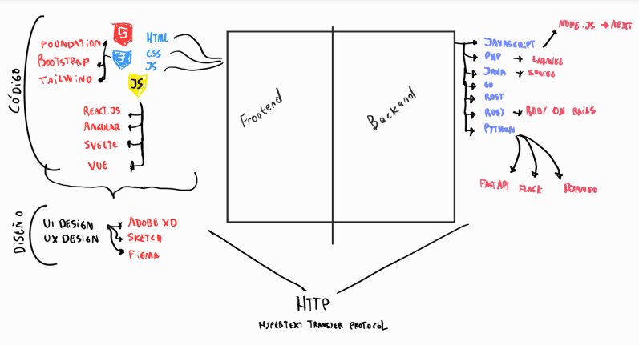

# 5_Curso_de_Introduccion_al_Desarrollo_Backend

<p align="center"></p>

     

# Ying y Yang de una Aplicación : Fronted y Backend



# Framework vs. Libreía 

## Framework

Será la base sobre la cual podrás construir y desarrollar tu proyecto, incluye todas las herramientas necesarias para completarlo(incluye librerías, estándares y reglas). 

## Librería

Sólo aborda una utilidad específica, pudiendo agregar más de una en tu proyecto. Eso si, asegurate que no interfieran con el código de otra librería. 

*Recuerda: Ninguno es mejor que el otro, todo va a depender de la necesidad de tu proyecto*

# Cómo se Conecta el Frontend con el Backend: API y JSON

La unión entre el Frontend y el Backend se hace a través de una API: Application Programming Interface.

Una API es una sección del backend que permite que el frontend pueda comunicarse con él a través de mensajes bidireccionales (de ida y vuelta).

Tenemos dos grandes estándares para crear las APIs:

* SOAP (Simple Objetct Access Protocol): Mueve la información a través de un lenguaje XML (Extensible Markup Language). Es similar al HTML, es un lenguaje demarcado. SOAP es un protocolo que ha quedado en el olvido.
```xml
<?xml version="1.0"?>
<note>
    <to>Miguel</to>
    <from>Facundo</from>
    <heading>Recordatorio</heading>
    <body>¡No olvides publicar el curso!</body>
</note>
```
* Rest (Representational State Transfer): Utiliza otro lenguaje JSON (Javascript Objet Notation). Un JSON no es más que un diccionario de Python. Los diccionarios de Python son lo mismo que los objetos de JS.

```python
{
    "firstname": "Jhon",
    "lastname": "Smith",
    "isAlive": true,
    "age": 27,
    "address": {
        "streetAddress": "21 2nd Street",
        "city": "New York",
        "state": "NY",
        "postalCode": "10021-3100"
    },
    "phoneNumbers": [
        {
            "type": "home",
            "number": "212 555-1234"
        },
        {
            "type": "office",
            "number": "646 555-4567
        }
    ],
    "children": [],
    "spouse: null
}
```


